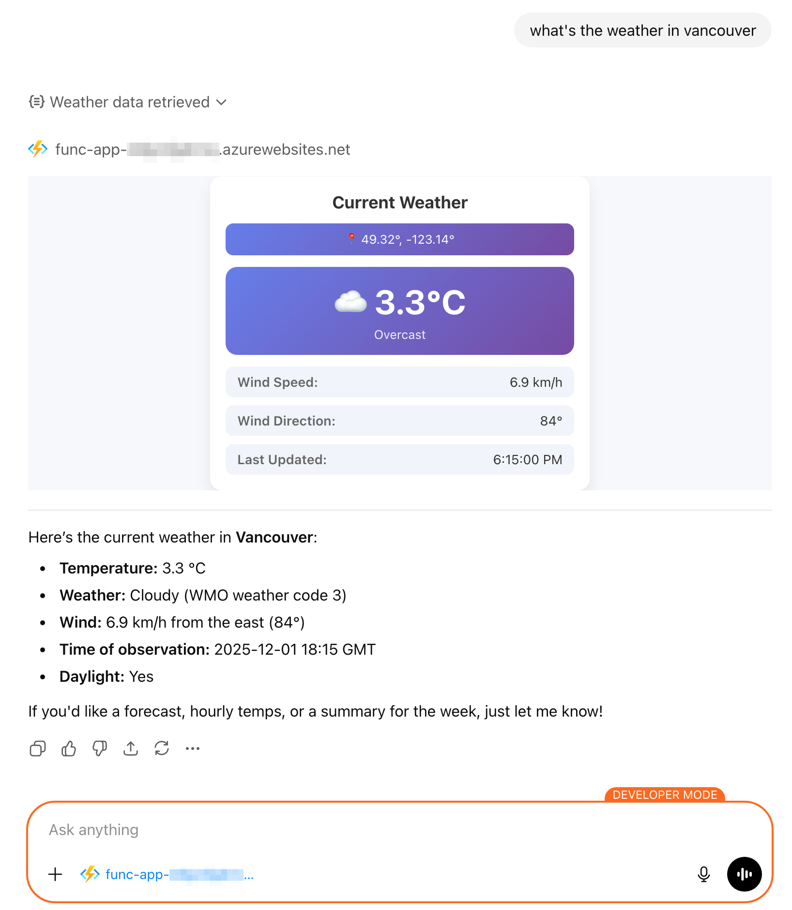

# Weather App for ChatGPT

A ChatGPT app that provides current weather information with an interactive widget, built using the [OpenAI Apps SDK](https://developers.openai.com/apps-sdk) and deployed to Azure Functions.



## Overview

This app demonstrates how to build a ChatGPT app using the Model Context Protocol (MCP) and the FastMCP Python framework. It fetches real-time weather data from the [Open-Meteo API](https://open-meteo.com/) and displays it in an interactive HTML widget directly within ChatGPT conversations.

## Features

- **Natural Language Interface**: Ask ChatGPT for weather in any location (e.g., "What's the weather in Seattle?")
- **Interactive Widget**: View weather data in a beautifully designed card with:
  - Current temperature with weather emoji
  - Weather condition description
  - Wind speed and direction
  - Location coordinates
  - Last updated timestamp
- **Real-time Data**: Fetches current weather from Open-Meteo API
- **Self-Hosted on Azure**: Deployed as a remote MCP server on Azure Functions

## Architecture

The app consists of two main components:

### 1. MCP Server (`main.py`)
- Built with [FastMCP](https://gofastmcp.com/) Python framework
- Exposes a `get_current_weather` tool that ChatGPT can call
- Returns structured weather data from Open-Meteo API
- Configured for stateless HTTP transport

### 2. Interactive Widget (`current_weather_widget.html`)
- HTML/CSS/JavaScript component rendered in ChatGPT
- Uses the OpenAI Apps SDK (`window.openai`) for integration
- Displays weather data with WMO weather code interpretation
- Responsive design optimized for ChatGPT's interface

## Prerequisites

- Python 3.12 or higher
- [uv](https://docs.astral.sh/uv/) - Fast Python package installer
- [Azure Functions Core Tools](https://learn.microsoft.com/en-us/azure/azure-functions/functions-run-local) v4.5.0 or higher
- [Azure Developer CLI (azd)](https://learn.microsoft.com/en-us/azure/developer/azure-developer-cli/install-azd)
- ChatGPT account with [Developer Mode enabled](https://platform.openai.com/docs/guides/developer-mode)

## Local development

### 1. Install dependencies

```bash
# Install uv if you haven't already
curl -LsSf https://astral.sh/uv/install.sh | sh

# Install dependencies and create virtual environment
uv sync
```

### 2. Run locally

```bash
# Start the MCP server with uv
uv run func start
```

The server will start on `http://localhost:7071` by default.

### 3. Test with MCP Inspector

You can use the [MCP Inspector](https://modelcontextprotocol.io/docs/tools/inspector) to test your server locally:

```bash
npx @modelcontextprotocol/inspector@latest http://localhost:7071/mcp
```

### 4. Expose to public internet (for ChatGPT testing)

During development, use [dev tunnels](https://learn.microsoft.com/en-us/azure/developer/dev-tunnels/get-started) to expose your local server:

```bash
# Install devtunnel CLI if you haven't already
# See: https://learn.microsoft.com/en-us/azure/developer/dev-tunnels/get-started

# Login to dev tunnels (required on first use)
devtunnel user login

# Create a tunnel and host on port 8000
devtunnel host -p 7071 --allow-anonymous
```

The command will output a public HTTPS URL (e.g., `https://<tunnel-id>.devtunnels.ms`). Use this URL with the `/mcp` path when connecting to ChatGPT.

### 5. Connect to ChatGPT

1. Open ChatGPT Settings → **Apps & Connectors** → **Advanced settings**
2. Enable **Developer mode**
3. Navigate to **Settings** → **Connectors**
4. Click **Create** to add a new connector
5. Enter your dev tunnel URL with `/mcp` path: `https://<tunnel-id>.devtunnels.ms/mcp`
6. Name your connector (e.g., "Weather")
7. Add a description: "Get current weather information"
8. Click **Create**

**To use the app:**
1. Start a new chat in ChatGPT
2. Click the **+** button and select your Weather connector
3. Ask: "What's the weather in New York?"
4. ChatGPT will call your tool and display the interactive weather widget

## Deployment to Azure

Deploy your app to Azure using the Azure Developer CLI (azd):

```bash
# Login to Azure
azd auth login

# Provision and deploy (first time)
azd up

# For subsequent deployments (code changes only)
azd deploy
```

The `azd up` command will:
1. Provision Azure resources (Function App, Storage, etc.)
2. Deploy your code to Azure Functions
3. Output the deployment URL (e.g., `https://<your-app>.azurewebsites.net`)

Once deployed, connect to ChatGPT using your Azure URL with `/mcp` path: `https://<your-app>.azurewebsites.net/mcp`

### Add your deployed app to ChatGPT

Follow the same steps as in [Local Development - Connect to ChatGPT](#5-connect-to-chatgpt), but use your Azure deployment URL instead:

1. In ChatGPT Settings → **Connectors**, click **Create**
2. Enter your Azure URL with `/mcp` path: `https://<your-app>.azurewebsites.net/mcp`
3. Name it (e.g., "Weather") and add a description
4. Click **Create**

Then test it by starting a new chat, adding your connector, and asking about the weather!

## Project structure

```
.
├── main.py                         # MCP server with FastMCP
├── current_weather_widget.html     # Interactive weather widget UI
├── host.json                       # Azure Functions configuration
├── pyproject.toml                 # Python project metadata and dependencies
├── uv.lock                        # uv lock file for reproducible builds
├── azure.yaml                     # Azure Developer CLI configuration
└── infra/                         # Azure infrastructure (Bicep files)
    ├── main.bicep
    ├── main.parameters.json
    └── app/
        ├── app.bicep
        ├── entra.bicep
        ├── rbac.bicep
        └── vnet.bicep
```

## Key configuration files

### `host.json`
Configures Azure Functions to run as a custom handler for the MCP server:

```json
{
  "version": "2.0",
  "configurationProfile": "mcp-custom-handler",
  "customHandler": {
    "description": {
      "defaultExecutablePath": "python",
      "arguments": ["main.py"]
    },
    "port": "8000"
  }
}
```

### `main.py`
The MCP server that:
- Sets `fastmcp.settings.stateless_http = True` for Azure Functions compatibility
- Registers the weather widget as a resource with `text/html+skybridge` MIME type
- Defines the `get_current_weather` tool with OpenAI metadata

## How it works

1. **User asks ChatGPT**: "What's the weather in New York?"
2. **ChatGPT interprets**: Determines coordinates for New York (40.7128, -74.0060)
3. **Calls your tool**: Invokes `get_current_weather` with latitude and longitude
4. **Server fetches data**: Your Azure Function calls Open-Meteo API
5. **Returns structured data**: JSON response with current weather
6. **Widget renders**: ChatGPT displays the HTML widget with weather information

## Apps SDK features used

- **Tools**: `@mcp.tool()` decorator defines callable functions for ChatGPT
- **Resources**: `@mcp.resource()` exposes the HTML widget as `ui://widget/current-weather.html`
- **Metadata**: Tool annotations for title, hints, and invocation messages
- **Output Templates**: Links tool responses to the widget for rendering
- **Structured Content**: Returns both text and JSON for flexible display options

## Security & privacy

- **API Keys**: No authentication required for Open-Meteo (free public API)
- **Data Collection**: Only processes latitude/longitude coordinates
- **Privacy**: No user data is stored or logged
- **Built-in Auth**: Azure App Service authentication can be enabled for production use

## Learn more

- [OpenAI Apps SDK Documentation](https://developers.openai.com/apps-sdk)
- [Model Context Protocol](https://modelcontextprotocol.io/)
- [FastMCP Framework](https://gofastmcp.com/)
- [Azure Functions MCP Hosting](https://learn.microsoft.com/en-us/azure/azure-functions/self-hosted-mcp-servers)
- [Open-Meteo API](https://open-meteo.com/en/docs)

## Contributing

Contributions are welcome! Feel free to:
- Report bugs or issues
- Suggest new features or improvements
- Submit pull requests

## License

MIT License - see [LICENSE](LICENSE) file for details.

## Acknowledgments

- Built with the [OpenAI Apps SDK](https://developers.openai.com/apps-sdk)
- Weather data from [Open-Meteo](https://open-meteo.com/)
- Hosted on [Azure Functions](https://azure.microsoft.com/en-us/products/functions)
